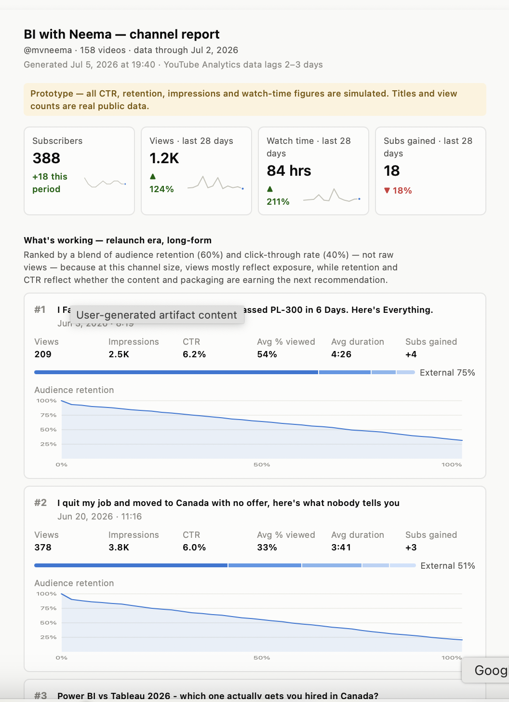
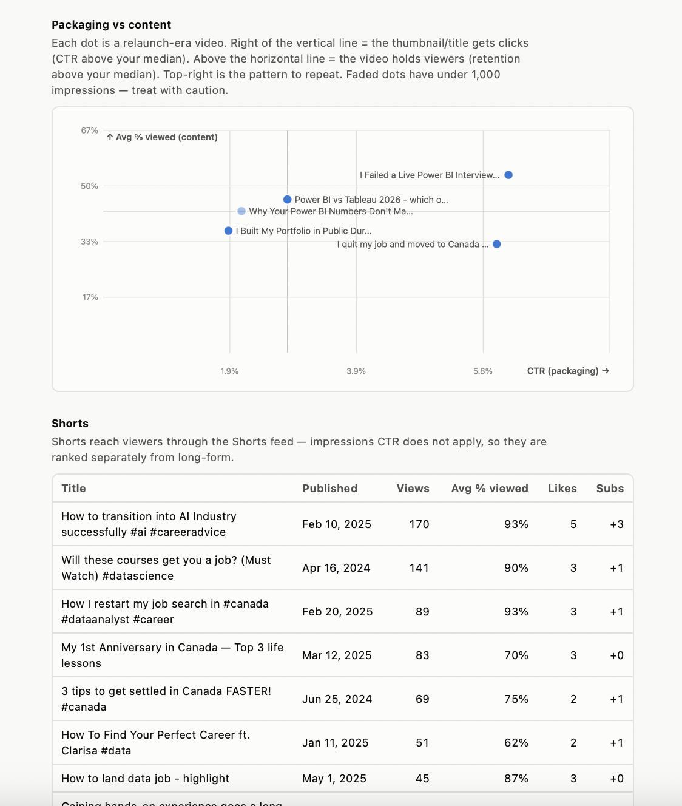

# Screenshots

Visual walkthrough of the agentic workflow, from discovery interview through
final dashboard.

## Discovery interview
The skill asking one high-leverage question at a time instead of dumping a form.

## Fable session overview

## Blind-spot pass
The skill flagging the public-API vs. OAuth vs. CSV fork before writing any code.

## Implementation plan
The plan presented for approval before any code was written.

## Final dashboard

